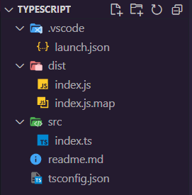

# Typescript notes

## What is typescript?
- programming lang to address the shortcomings of JS
- built on top of JS
- help build more robust code
- to be used on medium/large projects, whereas JS is simple/small projects

### PROs:
- static typing: cant change variable type ex string -> number
- code completion
- refactoring
- shorthand notations
- code completion/intellisense. TS will autocomplete properties and methods based on the type that you've set a variable (great productivity boost feature)

TLDR: javascript, but with type checking

### CONs:
- gotta compile .ts -> .js (transpliation)

## Setting up Typescript
In terminal:
`npm i -g typescript`  
`-g` is a flag that installs the package globally. If permission error, add prefix `sudo`.

To verify that it's installed:
`tsc -v`  
`-v` is flag that checks version.

## Setting up to compile .ts to .js  
To avoid older syntax when compiling, create config files to tell TS to compile in ES6.

In terminal of your root folder:  
`tsc --init`  
Which creates a config file `tsconfig.json` in your project folder. Also will tell you in the terminal the settings that's been enabled with it. There's a bunch of settings with its description.

### Few config settings to note
- `"target": "ES2016"` Which version of javascript the typescript complier is going to generate. Default is ES2016, which is usually the safest(?), since all browsers support it. Press `ctrl+space` to see different options.  
- `"module": "commonjs"`  
- `"rootDir": "./src"` by convention, source code (.ts code file) should be in a seperate folder called src.  
  
- `"outDir": "./dist"` the directory that contains our js files (finishedcomplied code). Usually, it's in a folder called `dist`.  
- `"removeComments": "true"` just removes the comments in the .ts when we compile to .js  
- `"noEmitOnError": "true"` when this is turned on, the complier will stop compiling when there is an error in our code (usually it's compiled anyways, we'd want the opposite of that lol)  
- `"noUnusedParameters": true` a rule that helps devs to see if they've used all of a function's parameters when they're writing out the function code
- `"noImplicitReturns": true` a rule that tells us if a function returns a value that is the same type as the type we've stated, for example, a conditional statement where we forget to return a value (undefined)
- `"noUnusedLocals": true` a rule that ensures that local variables are not forgotten and they're being used

## Finally, let's compile
In your project terminal  
`tsc`  
Since we've did the set up in the config file, we can omit writing `tsc index.ts` or any other of the sort.  

Run the .js file to test your app with `node dist/index.js`.

## Generating more optimized code (enums)
Say you have enums in your .ts file, and you compile your code. You can see that the code in .js can be very lengthy and is repetitive. For ex  

In typescript:  
```
enum Size { Small = 1, Medium, Large }
let mySize: Size = Size.Small;
console.log(mySize);
```   

Complied to javascript:  
```
var Size;
(function (Size) {
    Size[Size["Small"] = 1] = "Small";
    Size[Size["Medium"] = 2] = "Medium";
    Size[Size["Large"] = 3] = "Large";
})(Size || (Size = {}));
let mySize = Size.Small;
console.log(mySize);
```

This can be avoided by adding `const` before `enums`. ex:  
`const enum Size { Small = 1, Medium, Large }`